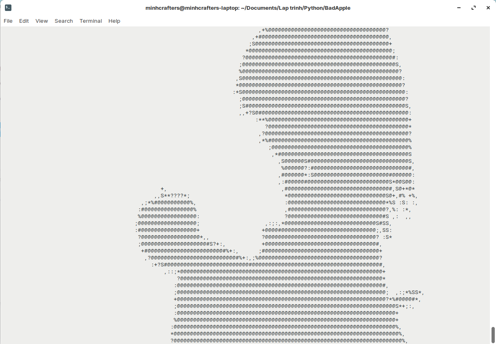

## Bad Apple!! in Python using OpenCV and Pygame

This is a Python script that converts frames of the Bad Apple video (or any videos that has 2 states) to ASCII characters using OpenCV and display them on a terminal window with the music using Pygame.

Requires Python 3.6+. For Windows and Linux only.

