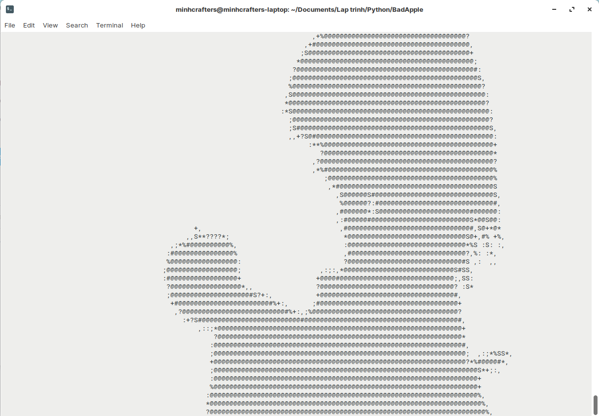

## **Overview**

This is a Python script that converts frames of the Bad Apple video (or any videos that has 2 states) to ASCII characters and display them on a terminal window using OpenCV with the music using Pygame. No frame extraction is needed.

Requires Python 3.6+. For Windows and Linux only.

